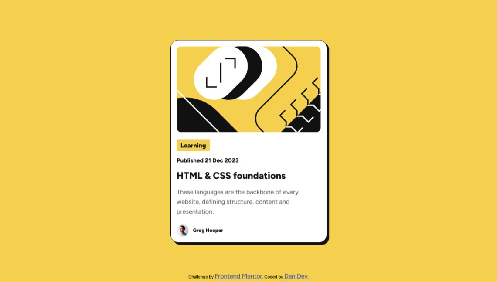
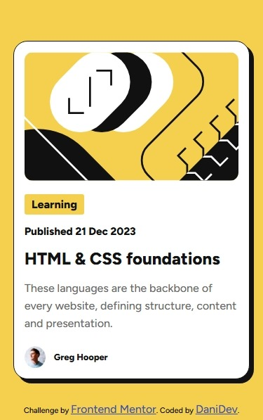

# Frontend Mentor - Blog preview card solution

This is a solution to the [Blog preview card challenge on Frontend Mentor](https://www.frontendmentor.io/challenges/blog-preview-card-ckPaj01IcS). Frontend Mentor challenges help you improve your coding skills by building realistic projects. 

## Table of contents

- [Overview](#overview)
  - [The challenge](#the-challenge)
  - [Screenshot](#screenshot)
  - [Links](#links)
- [My process](#my-process)
  - [Built with](#built-with)
  - [What I learned](#what-i-learned)
  - [Continued development](#continued-development)
  - [Useful resources](#useful-resources)
- [Author](#author)
- [Acknowledgments](#acknowledgments)

## Overview

### The challenge

Users should be able to:

- See hover and focus states for all interactive elements on the page

### Screenshot





### Links

- Solution URL: [Link to solution](https://github.com/Adeykiz/Fontend-Mentor-Blog-Preview-Card)
- Live Site URL: [Link to live site](https://adeykiz.github.io/Fontend-Mentor-Blog-Preview-Card/)

## My process

### Built with

- Semantic HTML5 markup
- CSS custom properties
- Flexbox

### What I learned

This project help me refresh my memory on some css properties that I've forgotten 😂. For example, importing and using fonts:
```
@font-face{
  font-family: "Figtree";
  src: url(Resources/assets/fonts/static/Figtree-ExtraBold.ttf);
  font-weight: 800;
  font-style: normal;
}
```

It also helped me learn how to adjust properties of elements in correlation to either the page's width/height; this way, eliminating the need for media queries


### Continued development

I'd like to continue/focus/refine the clamp(), min() and max() techniques for proper and more efficient use.

### Useful resources

- [ChatGPT](https://www.chatgpt.com) - This helped me grasp the basic concept of clamp, min and max css properties

## Author

- Frontend Mentor - [@Adeykiz](https://www.frontendmentor.io/profile/Adeykiz)


## Acknowledgments

I'll like to acknowledge the frontend mentor team for this platform they are building to help developers like us grow by practicing/participating in hands-on projects and challenges
